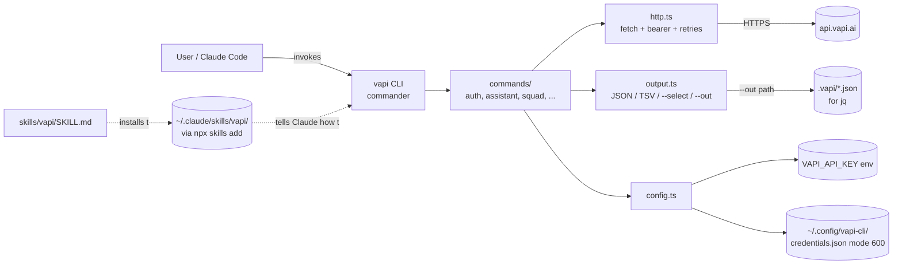

# Plan: `vapi-cli` — a TypeScript CLI + Claude skill for Vapi

## Context

The Vapi MCP server can't return large payloads (e.g. a full assistant system prompt), which makes it useless for the most common Vapi tasks. The pattern qbo-cli established for QuickBooks works around this: a thin CLI hits the API, dumps JSON to stdout (or to a local file), and a SKILL.md teaches Claude to drive the CLI and process results with `jq`. This repo will do the same thing for Vapi.

Goals:
- **Full coverage of `assistant` and `squad`** (the user's must-have).
- Phased rollout for the rest of the Vapi surface, with a coverage table in the README as the source of truth.
- TypeScript implementation, distributed as an npm package.
- A bundled SKILL.md so Claude users install with one command.
- Clear, documented API-key configuration.

Reference inspiration (verified locally in `/tmp/qbo-cli`): `skills/qbo/SKILL.md` (frontmatter + concise body + references), `--json`/`--results-only`/`--select`/`--dry-run`/`--no-input` flag conventions, `qbo schema --json` for agent introspection, structured exit codes.

Verified Vapi API shape (from `@vapi-ai/server-sdk` v1.2.0 source in `/tmp/vapi-sdk`):
- Base URL: `https://api.vapi.ai`. Auth: `Authorization: Bearer <VAPI_API_KEY>`.
- Endpoints follow `/<resource>` and `/<resource>/{id}`. Methods: `GET` list, `POST` create, `GET {id}`, `DELETE {id}`, `PATCH {id}`.
- Responses are **unwrapped** — list returns `Assistant[]` directly, get returns `Assistant` directly. Simpler than QBO's `{QueryResponse:{Invoice:[...]}}` wrapper.
- Resource set in current SDK: `assistants`, `squads`, `calls`, `chats`, `sessions`, `tools`, `files`, `phoneNumbers`, `campaigns`, `analytics`, plus `structuredOutputs`, `insight`, `eval`, `observabilityScorecard`, `providerResources`.

## Architecture



Repo layout (single package, no monorepo):

```
vapi-cli/
├── package.json              # bin: { vapi: ./dist/cli.js }, type:module, node>=18
├── tsconfig.json
├── tsup.config.ts            # bundle src/cli.ts -> dist/cli.js with shebang
├── README.md                 # install + coverage table (phased)
├── src/
│   ├── cli.ts                # commander root; registers only IMPLEMENTED commands
│   ├── config.ts             # resolveApiKey(), paths, load/save credentials
│   ├── http.ts               # vapiFetch(method, path, {query, body}); maps HTTP -> exit code
│   ├── output.ts             # emit(data, opts): JSON/plain, --select, --out
│   ├── exit-codes.ts         # const EXIT = { OK:0, ERR:1, USAGE:2, EMPTY:3, AUTH:4, NOT_FOUND:5, FORBIDDEN:6, RATE_LIMIT:7, RETRYABLE:8, NOT_IMPLEMENTED:9, CONFIG:10 }
│   ├── schema.ts             # walks commander tree -> JSON for `vapi schema`
│   └── commands/
│       ├── auth.ts           # login | status | logout
│       ├── assistant.ts      # list | get | create | update | delete
│       └── squad.ts          # (Phase 2) list | get | create | update | delete
├── skills/
│   └── vapi/
│       ├── SKILL.md
│       └── references/
│           └── COMMANDS.md
└── tests/
    ├── http.test.ts          # mocks fetch; verifies bearer header, error -> exit code
    └── assistant.test.ts     # mocks fetch; verifies list/get/create/update/delete shape
```

## Phase 1 — foundation + assistants (this PR)

Ship a working CLI for the only must-have resource the user called out, plus the scaffolding everything else slots into.

**Package & build**
- `package.json`: `"name": "vapi-cli"`, `"bin": { "vapi": "./dist/cli.js" }`, `"type": "module"`, deps: `commander`, `chalk`. Dev deps: `typescript`, `tsup`, `vitest`, `@types/node`.
- `tsconfig.json`: target `ES2022`, module `ESNext`, `moduleResolution: "bundler"`, `strict: true`.
- `tsup.config.ts`: entry `src/cli.ts`, format `esm`, target `node18`, banner `#!/usr/bin/env node`, `clean: true`.
- Decision: no `@vapi-ai/server-sdk` dependency. Use native `fetch`. We need full coverage faster than the SDK ships and we want zero translation layer between API and JSON output.

**`src/config.ts`** — credentials handling
- Resolution order: `process.env.VAPI_API_KEY` > `~/.config/vapi-cli/credentials.json` (`{ "apiKey": "...", "orgId"?: "..." }`).
- `~/.config/vapi-cli/` chosen over `~/.vapi-cli/` to follow XDG and match what qbo does. Path resolved via `process.env.XDG_CONFIG_HOME ?? path.join(os.homedir(), '.config')`.
- `saveCredentials({apiKey})` writes with `fs.writeFileSync(path, JSON, { mode: 0o600 })` and `fs.chmodSync` after to be safe on platforms that ignore mode in writeFile.
- `requireApiKey()` throws `ConfigError` (exit 4 AUTH) with a one-line hint pointing at `vapi auth login`.

**`src/http.ts`** — single thin client
- `export async function vapiFetch(method, path, { query, body, apiKey, baseUrl })`. Headers: `Authorization: Bearer ${apiKey}`, `Content-Type: application/json` when body present, `User-Agent: vapi-cli/<version>`.
- `baseUrl` defaults to `https://api.vapi.ai`, overridable via `VAPI_BASE_URL` env (useful for tests/local proxies).
- Maps response status to exit code: 401/403→AUTH/FORBIDDEN, 404→NOT_FOUND, 429→RATE_LIMIT, 5xx→RETRYABLE with one retry on 5xx/429 with a 1s backoff. No exponential backoff in v1 — keep it boring.
- On non-2xx, prints the parsed error body to stderr and `process.exit(code)`. Stdout stays clean for piping.

**`src/output.ts`** — output modes
- Global flags: `--json`/`-j`, `--plain`/`-p`, `--select <fields>` (alias `--fields`), `--out <path>`, `--dry-run`/`-n`, `--no-input`, `--force`/`--yes`, `--verbose`/`-v`.
- `emit(data, ctx)`:
  - `--out`: `fs.mkdirSync(dirname, {recursive:true})` then write JSON; print `{"path":"<resolved>"}` to stdout (so agents can chain), human-readable note to stderr.
  - `--select`: project top-level keys only (dot paths are the user's job via jq — keep the CLI tiny).
  - default: pretty JSON to stdout if TTY, compact JSON if piped.
  - `--plain`: TSV of top-level scalar fields (skipped for nested) — best-effort; `--json` is the canonical machine path.
- Empty list → exit 3 (EMPTY) so agents can branch without parsing.

**`src/commands/auth.ts`**
- `vapi auth login [--key <k>] [--no-input]`: takes key from `--key`, else from stdin if `!--no-input`, else fails with USAGE. Validates by hitting `GET /assistant?limit=1` — 200 confirms; 401 → AUTH error. Persists via `saveCredentials`.
- `vapi auth status`: prints redacted key (`sk-...abcd`), config path, env-vs-file source, and whether validation call succeeds. JSON mode emits `{ "authenticated": bool, "source": "env"|"file", "keyPreview": "...", "baseUrl": "..." }`.
- `vapi auth logout`: deletes the credentials file (does not touch env). Honors `--force` to skip confirmation.

**`src/commands/assistant.ts`** — full CRUD
| Command | Endpoint |
|---|---|
| `vapi assistant list [--limit N] [--created-at-gt ISO] [--created-at-lt ISO]` | `GET /assistant` (forward all flags as query params) |
| `vapi assistant get <id>` | `GET /assistant/{id}` |
| `vapi assistant create -f <file\|->` | `POST /assistant` |
| `vapi assistant update <id> -f <file\|->` | `PATCH /assistant/{id}` |
| `vapi assistant delete <id> [--force]` | `DELETE /assistant/{id}` |

`-f -` reads JSON from stdin. `-f <path>` reads from disk. `--dry-run` prints the planned `{method, url, body}` to stdout and exits 0 without calling the API.

**`src/commands/squad.ts`** — same five-command shape against `/squad`. Implement in the same PR since the user explicitly listed both as must-haves. (If scope pressure forces a split, squad can ship in Phase 2 — but default is Phase 1.)

**`src/cli.ts`** — wires everything
- `program.name('vapi').version(pkg.version)`. Global options registered via `program.option(...)`.
- `program.addCommand(assistantCmd)`, `program.addCommand(squadCmd)`, `program.addCommand(authCmd)`.
- `program.command('schema [cmd]').description('Dump CLI tree as JSON').action(...)` — walks `program.commands`, emits `{name, description, options, subcommands}`.
- `program.command('exit-codes').action(...)` — prints the `EXIT` map as JSON.
- Top-level error handler: anything thrown becomes `{error: msg, code}` to stderr + correct exit.

**`skills/vapi/SKILL.md`** — match the depth of qbo's skill (their SKILL.md is ~165 lines, their COMMANDS.md ~170 lines; they pack in concrete examples, not pointers). Frontmatter:

```yaml
---
name: vapi
description: Manage Vapi voice AI configuration via the vapi CLI — read full assistant system prompts, edit assistants, create/update squads, list calls. Use whenever the user asks about Vapi assistants, squads, tools, calls, phone numbers, files, chats, or sessions.
allowed-tools: Bash(vapi *), Bash(jq *)
---
```

Body sections (each must include real, copy-pasteable commands — not just descriptions):

1. **Install** — `npm i -g vapi-cli` plus an `npx vapi` fallback for one-offs.
2. **Getting an API Key** — link to the Vapi dashboard path, note **private** key (Bearer auth) vs public (browser SDK only) so users don't paste the wrong one.
3. **Setup** — three configuration paths with bash blocks:
   - `export VAPI_API_KEY=...` (preferred for CI / ephemeral shells)
   - `vapi auth login` interactive (writes `~/.config/vapi-cli/credentials.json`, mode 600)
   - `vapi auth login --key $VAPI_API_KEY --no-input` (scripted)
4. **Verify** — `vapi auth status` and `vapi assistant list --limit 1 --json`.
5. **Response Shape** — table contrasting Vapi's unwrapped responses with QBO's wrapping. Tell Claude: list returns `Assistant[]` directly, get/create/update return `Assistant` directly, delete returns the deleted entity. No `.QueryResponse` jq indirection.
6. **Working with large payloads (the `--out` pattern)** — this is the killer feature vs. MCP. Concrete examples:
   ```bash
   # Snapshot all assistants once, then jq locally
   vapi assistant list --out .vapi/assistants.json
   jq '.[].name' .vapi/assistants.json

   # Pull one assistant's full system prompt — never truncated
   vapi assistant get $ID --out .vapi/assistants/$ID.json
   jq -r '.model.messages[] | select(.role=="system") | .content' .vapi/assistants/$ID.json

   # Clone-and-edit: pull, mutate with jq, push back
   vapi assistant get $ID --out /tmp/a.json
   jq '.model.messages |= map(if .role=="system" then .content="NEW PROMPT" else . end)' \
       /tmp/a.json > /tmp/a.patch.json
   vapi assistant update $ID -f /tmp/a.patch.json
   ```
7. **Common Patterns** — at minimum: list-with-filter, get-by-id-then-extract-field, create-from-stdin, sparse-update-with-jq, delete-with-confirmation. One bash block per pattern, like qbo's "Common Patterns" section.
8. **Workflow: build a squad from scratch** — a multi-step example mirroring qbo's `customer→item→invoice→payment` walkthrough. Steps: create receptionist assistant → create specialist assistant → create squad with both as members and routing destinations → list squads to confirm. Each step a copy-pasteable bash block that pipes the prior step's `Id` into the next via `jq -r '.id'`.
9. **Workflow: edit an assistant's system prompt safely** — pull → diff → patch with `--dry-run` → apply. Demonstrates the read/edit/write loop Claude will use most often.
10. **Troubleshooting table** — at least: 401 (key invalid / using public key), 403 (key lacks scope), 404 (id from wrong org), 429 (rate limit, retry), `VAPI_API_KEY not set`, "system prompt looks empty" (model.messages may be missing — fall back to `model.systemPrompt` for older assistants).
11. **Agent Introspection** — `vapi schema --json`, `vapi schema assistant --json`, `vapi exit-codes --json`.
12. **Exit Codes** — inline list (0/1/2/3/4/5/6/7/8/9/10) so agents don't have to call `exit-codes` to branch.
13. **Reference** — pointer to `references/COMMANDS.md`.

**`skills/vapi/references/COMMANDS.md`** — full reference, ~150–200 lines, mirroring qbo's layout:

- Global flags table (with aliases like `--fields`/`--select`, `--yes`/`--force`, `--machine`/`--json`).
- Response Shapes table (per command: list, get, create, update, delete).
- Per-command section with: signature, flags, 1–2 concrete bash examples, the underlying HTTP endpoint. Cover every implemented command (`auth login/status/logout`, `assistant list/get/create/update/delete`, `squad list/get/create/update/delete`, `schema`, `exit-codes`).
- Supported resources table with ✅/⏳ markers — same rows as the README coverage table so the skill stays in sync with what's shipped.
- Environment variables table (`VAPI_API_KEY`, `VAPI_ORG_ID`, `VAPI_BASE_URL`, `VAPI_CONFIG_DIR`).

Both files should target real density, not summaries. If a section doesn't have a runnable command, it doesn't belong.

**README.md** with the coverage table — this is the user's "tracked in the readme" requirement:

```
| Resource         | Status | Commands                      |
|------------------|--------|-------------------------------|
| auth             | ✅      | login, status, logout         |
| assistant        | ✅      | list, get, create, update, delete |
| squad            | ✅      | list, get, create, update, delete |
| tool             | ⏳ phase 2 |                           |
| call             | ⏳ phase 3 |                           |
| phone-number     | ⏳ phase 3 |                           |
| file             | ⏳ phase 4 |                           |
| chat             | ⏳ phase 5 |                           |
| session          | ⏳ phase 5 |                           |
| campaign         | ⏳ phase 5 |                           |
| analytics        | ⏳ phase 5 |                           |
```

(Use plain emoji or text markers — no special chars. README also lists install, auth, and "use with Claude" sections.)

## Phases 2–5 (later PRs, tracked in README)

- **Phase 2:** `vapi tool {list,get,create,update,delete}` against `/tool`.
- **Phase 3:** `vapi call ...` against `/call` (note: `call list` is the highest-volume read; lean on `--out` and pagination flags) and `vapi phone-number ...` against `/phone-number`.
- **Phase 4:** `vapi file ...` against `/file`. Files endpoint needs multipart upload — first place the CLI exceeds simple JSON; isolate it with a `multipart` helper in `http.ts`.
- **Phase 5:** `chat`, `session`, `campaign`, `analytics`. `analytics get` is `POST /analytics` with a body — slightly off the CRUD pattern; document accordingly.

Each phase: add commands under `src/commands/`, register in `cli.ts`, document in `references/COMMANDS.md`, flip the README row to ✅. SKILL.md doesn't need an edit each phase unless workflow patterns change — the description already covers the surface.

## API key configuration & Claude install (the user's specific concern)

Document three paths in README + SKILL.md:

1. **Env var (simplest, recommended for CI):** `export VAPI_API_KEY=...` — overrides everything.
2. **Persisted file (recommended for desktop):** `vapi auth login` prompts and saves to `~/.config/vapi-cli/credentials.json` (mode 600).
3. **Adding to Claude Code:**
   - Install CLI globally: `npm i -g vapi-cli`.
   - Install skill: `npx skills add -g <owner>/vapi-cli` (skill lives at `skills/vapi/SKILL.md` so the `skills` tool finds it).
   - Skill frontmatter declares `allowed-tools: Bash(vapi *), Bash(jq *)` so Claude doesn't prompt for permission on every call.

## Critical files to create

- `package.json`, `tsconfig.json`, `tsup.config.ts`
- `src/cli.ts`, `src/config.ts`, `src/http.ts`, `src/output.ts`, `src/exit-codes.ts`, `src/schema.ts`
- `src/commands/auth.ts`, `src/commands/assistant.ts`, `src/commands/squad.ts`
- `skills/vapi/SKILL.md`, `skills/vapi/references/COMMANDS.md`
- `README.md` (overwrite the placeholder)
- `tests/http.test.ts`, `tests/assistant.test.ts`

## Verification

End-to-end checks before opening the PR:

1. `npm install && npm run build` — clean build, no TS errors.
2. `npm test` — vitest passes (mocked fetch in `http.test.ts`, command wiring in `assistant.test.ts`).
3. `node dist/cli.js --help` — lists `auth`, `assistant`, `squad`, `schema`, `exit-codes`.
4. `node dist/cli.js schema --json | jq 'keys'` — emits valid JSON with the registered command tree.
5. `VAPI_API_KEY=bogus node dist/cli.js auth status` — exit 4, stderr explains 401.
6. With a real key (manual; document in PR description, don't commit): `vapi assistant list --out .vapi/assistants.json` writes file, prints `{"path":...}`, exit 0. Empty account → exit 3.
7. `vapi assistant get <id> | jq .model.messages[0].content` returns the **full system prompt** — the headline win over MCP. Confirm it's untruncated.
8. `vapi assistant get <id> > a.json && jq '.name="renamed"' a.json | vapi assistant update <id> -f -` round-trips a PATCH.
9. `vapi assistant create -f bad.json --dry-run` prints the planned request and exits 0 without an API call.
10. Skill install: copy `skills/vapi/` into `~/.claude/skills/`, start Claude Code, ask "show me the system prompt for assistant X" — Claude should pick the skill and run `vapi assistant get`. (`npx skills add` wiring is verified by reading the published skill manifest; full publish-and-install loop happens after the package is on npm.)

If any check fails, the PR isn't ready.
